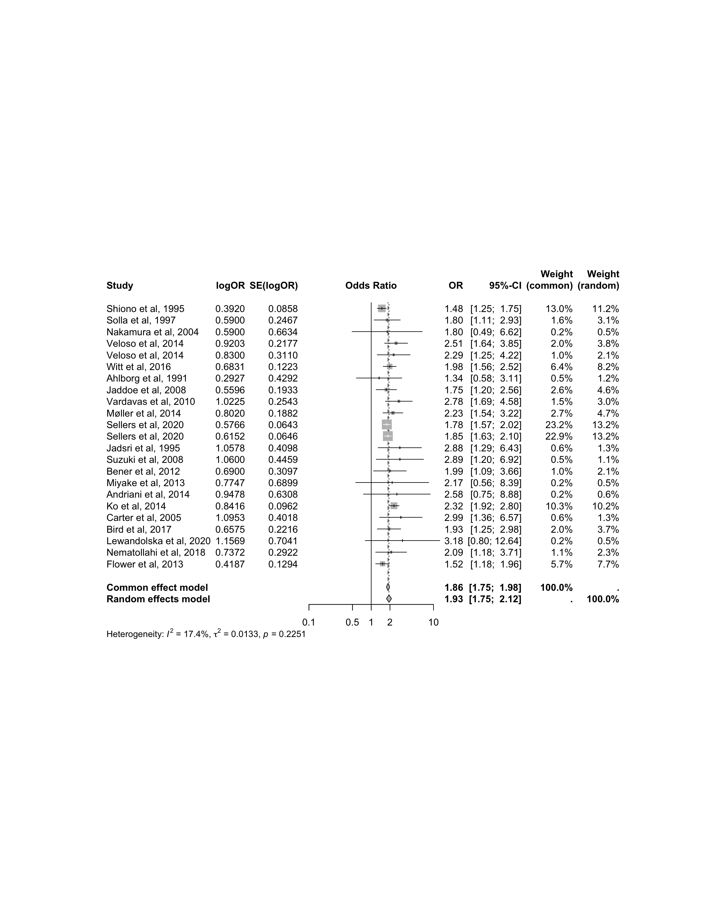

# Maternal Smoking and Low Birth Weight

This repository contains a small meta-analysis exploring the association between maternal smoking during pregnancy and low birth weight (LBW) in infants.  
The project was completed using data from the **prospective cohort studies** reported in *Di et al., World Journal of Pediatrics (2022)*.

---

### Overview

The goal was to reproduce the results for the prospective cohort subset (n = 23) from the original publication and to confirm the pooled odds ratio (OR) and heterogeneity estimates.

- **Data file:** `meta_data.csv` – log odds ratios and standard errors for each study  
- **Script:** `Analysis.R` – runs a random-effects meta-analysis using the `meta` package (REML method)  
- **Output:** `forest_plot.png` – generated forest plot of all included studies

---

### Summary of Results

Running the analysis produces a pooled odds ratio of **1.93 (95% CI: 1.75–2.12)** with low heterogeneity (**I² = 17%, p = 0.23**).  
This indicates that, across the prospective studies, maternal smoking during pregnancy is associated with higher odds of delivering a low-birth-weight infant.

---

### Reproducibility

All analyses were carried out in **R (version 4.x)** using the following packages:
- `meta`
- `tidyverse`

To reproduce the results:
1. Place `meta_data.csv` and `Analysis.R` in the same folder.  
2. Run `Analysis.R` in RStudio or the R console.  
3. The script will output the summary statistics and save the forest plot in the working directory.

---

This project was created as part of independent work on learning meta-analysis methods and aims to provide a clear, reproducible example of the workflow.

